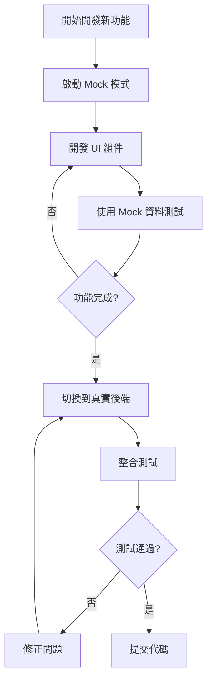

# PetSalon MSW Mock 系統使用指南

> **完整的 Mock Service Worker (MSW) 使用文檔**
> 讓前端開發完全獨立於後端，提升開發效率

**文檔版本**: 1.0
**最後更新**: 2025-10-11
**MSW 版本**: 2.7.0
**系統狀態**: ✅ 完全運作中

---

## 📋 目錄

- [概述](#概述)
- [快速開始](#快速開始)
- [使用指南](#使用指南)
- [資料說明](#資料說明)
- [Handler 說明](#handler-說明)
- [常見問題](#常見問題)
- [開發注意事項](#開發注意事項)
- [測試建議](#測試建議)
- [參考資源](#參考資源)

---

## 概述

### MSW 是什麼？

**MSW (Mock Service Worker)** 是一個 API mocking 函式庫，它透過攔截網路層級的 HTTP 請求來提供 mock 資料。與傳統的 mocking 方式不同，MSW 不需要修改應用程式代碼，完全透明地運作。

**工作原理**:
```
Vue App ──HTTP Request──> Service Worker (MSW) ──Mock Response──> Vue App
                               │
                               ├─ 匹配 Handler
                               ├─ 生成/獲取 Mock 資料
                               └─ 模擬網路延遲
```

### 為什麼使用 MSW？

✅ **前後端獨立開發** - 不需要等待後端 API 完成
✅ **零代碼侵入** - 不需要修改 API 呼叫代碼
✅ **真實的網路行為** - 模擬延遲、錯誤、狀態碼
✅ **提升開發效率** - 立即的回應，不需要啟動後端
✅ **一致的測試資料** - 可重現的測試場景
✅ **離線開發** - 完全不需要網路連線

### 系統架構

```
PetSalon 專案結構
│
├── PetSalon.Frontend/              # 前端專案
│   ├── src/
│   │   ├── api/                    # API 呼叫層 (不需修改)
│   │   ├── mocks/                  # MSW Mock 系統
│   │   │   ├── browser.ts          # MSW Worker 設定
│   │   │   ├── data/               # Mock 資料層
│   │   │   │   ├── pets.ts
│   │   │   │   ├── contacts.ts
│   │   │   │   ├── reservations.ts
│   │   │   │   ├── subscriptions.ts
│   │   │   │   ├── dashboard.ts
│   │   │   │   └── systemCodes.ts
│   │   │   └── handlers/           # API Handler 層
│   │   │       ├── petHandlers.ts
│   │   │       ├── contactHandlers.ts
│   │   │       ├── reservationHandlers.ts
│   │   │       ├── subscriptionHandlers.ts
│   │   │       ├── dashboardHandlers.ts
│   │   │       └── commonHandlers.ts
│   │   ├── views/
│   │   │   └── MswTest.vue         # 測試頁面
│   │   └── main.ts                 # MSW 初始化
│   ├── public/
│   │   └── mockServiceWorker.js    # Service Worker 腳本
│   ├── .env.mock                   # Mock 模式環境變數
│   └── vite.config.ts              # Vite 配置
└── MOCK_GUIDE.md                   # 本文檔
```

### 專案規模

| 項目 | 數量 | 說明 |
|------|------|------|
| **API 模組** | 6 個 | Pet, Contact, Reservation, Subscription, Dashboard, Common |
| **API 端點** | 48 個 | 完整的 RESTful CRUD 操作 |
| **Mock 資料** | 120+ 筆 | 寵物、聯絡人、預約、包月等 |
| **系統代碼** | 36 個 | 品種、性別、服務類型等 |
| **Handler 檔案** | 6 個 | 涵蓋所有業務邏輯 |
| **代碼行數** | 4000+ 行 | 完整的 TypeScript 實作 |

---

## 🚀 快速開始

### 環境需求

- **Node.js**: v18+ (專案使用 v24.7.0)
- **npm**: v9+
- **瀏覽器**: Chrome, Firefox, Safari, Edge (支援 Service Worker API)

### 第一次使用檢查清單

#### ✅ 步驟 1: 確認安裝

MSW 已經安裝完成，但你可以確認：

```bash
cd /Users/kun/Documents/Projects/PetSalon/PetSalon.Frontend

# 檢查 package.json
grep "msw" package.json
# 應該顯示: "msw": "^2.7.0"
```

#### ✅ 步驟 2: 啟動 Mock 模式

```bash
npm run dev:mock
```

你應該會看到：
```
🚀 Starting MSW in mock mode...
🔧 MSW Mock Service Worker initialized with 48 handlers

VITE v5.4.19 ready in 830 ms
➜  Local:   http://127.0.0.1:3000/
```

#### ✅ 步驟 3: 驗證 MSW 運作

**方法一：使用測試頁面（推薦）**

1. 開啟瀏覽器訪問：`http://127.0.0.1:3000/#/msw-test`
2. 查看測試結果：
   - 所有測試應該顯示 ✅ (綠色勾勾)
   - MSW 狀態應該顯示「active」(綠色)
   - 響應時間應該在 200-1000ms 之間

**方法二：檢查開發者工具**

1. 按 `F12` 開啟 DevTools
2. 切換到 **Console** 標籤：
   ```
   🚀 Starting MSW in mock mode...
   🔧 MSW Mock Service Worker initialized with 48 handlers
   ```

3. 切換到 **Network** 標籤：
   - 重新載入頁面或執行一個 API 請求
   - 請求應該顯示 `(from ServiceWorker)` 標記

4. 切換到 **Application** 標籤 > Service Workers：
   - 應該看到：`http://127.0.0.1:3000/mockServiceWorker.js`
   - 狀態：「activated and is running」

#### ✅ 步驟 4: 開始開發

現在你可以：
- 訪問任何頁面，資料會從 Mock API 載入
- 測試 CRUD 操作（創建、讀取、更新、刪除）
- 開發新功能而不需要後端伺服器

### 常用命令

```bash
# 開發模式（連接真實後端）
npm run dev

# Mock 模式（使用模擬資料）
npm run dev:mock

# 建置（連接真實後端）
npm run build

# 建置 Mock 版本
npm run build:mock

# 預覽建置結果
npm run preview

# 預覽 Mock 建置
npm run preview:mock
```

---

## 📖 使用指南

### Mock 模式 vs 真實後端

| 特性 | Mock 模式 | 真實後端 |
|------|-----------|----------|
| **啟動命令** | `npm run dev:mock` | `npm run dev` |
| **後端需求** | ❌ 不需要 | ✅ 需要運行 |
| **網路連線** | ❌ 不需要 | ✅ 需要 |
| **資料來源** | 記憶體中的 Mock 資料 | SQL Server 資料庫 |
| **資料持久化** | ❌ 重新載入後重置 | ✅ 永久保存 |
| **響應速度** | ⚡ 極快 (200-1000ms) | 🐢 取決於網路 |
| **資料完整性** | 預設 120+ 筆測試資料 | 取決於資料庫 |
| **適用場景** | 前端開發、UI 測試 | 整合測試、正式環境 |

### 何時使用 Mock 模式？

✅ **開發新功能** - 不需要等待後端 API
✅ **UI/UX 調整** - 快速迭代介面設計
✅ **單元測試** - 一致的測試資料
✅ **離線開發** - 在沒有網路的環境工作
✅ **Demo 展示** - 確保資料完整且美觀
✅ **學習專案** - 理解前端運作方式

### 何時使用真實後端？

✅ **整合測試** - 測試前後端協作
✅ **資料驗證** - 確認資料格式正確
✅ **性能測試** - 測試真實的網路延遲
✅ **部署前測試** - 確保一切運作正常
✅ **後端開發** - 測試新的 API 端點

### 如何在兩種模式間切換？

**切換到 Mock 模式**:
```bash
npm run dev:mock
```

**切換到真實後端**:
```bash
npm run dev
```

就這麼簡單！不需要修改任何代碼。

### 開發工作流程

#### 典型的開發流程



#### 範例：開發寵物列表功能

1. **啟動 Mock 模式**
   ```bash
   npm run dev:mock
   ```

2. **開發組件**
   ```vue
   <script setup>
   import { petApi } from '@/api/pet'

   const pets = ref([])

   async function loadPets() {
     const response = await petApi.getPets({ page: 1, pageSize: 12 })
     pets.value = response.data
   }

   onMounted(() => loadPets())
   </script>
   ```

3. **測試功能** - 資料會從 Mock API 載入

4. **調整 UI** - 快速迭代，立即看到結果

5. **切換到真實後端測試**
   ```bash
   # 停止 Mock 模式 (Ctrl+C)
   npm run dev
   ```

6. **確認整合正常** - 真實資料應該也能正常顯示

### 環境變數說明

#### `.env.mock` - Mock 模式環境變數

```env
# 啟用 MSW Mock
VITE_USE_MOCK=true

# API Base URL（留空，因為不需要後端）
VITE_API_BASE_URL=
```

#### `.env.development` - 開發模式環境變數

```env
# 停用 MSW Mock
VITE_USE_MOCK=false

# 連接到本地後端
VITE_API_BASE_URL=http://localhost:5150
```

#### `.env.example` - 環境變數範例

```env
# 環境變數範例檔案
VITE_USE_MOCK=false
VITE_API_BASE_URL=http://localhost:5150
```

**重要**:
- 不要修改 `.env.example`
- 不要提交包含敏感資訊的 `.env` 檔案
- 使用 `.env.local` 來覆蓋本地設定

---

## 🗄️ 資料說明

### Mock 資料概覽

PetSalon Mock 系統包含 **120+ 筆** 真實、豐富的測試資料：

| 資料類型 | 數量 | 檔案位置 | 說明 |
|---------|------|----------|------|
| 🐕 **寵物** | 22 筆 | `src/mocks/data/pets.ts` | 包含各種品種、年齡的寵物 |
| 👥 **聯絡人** | 17 筆 | `src/mocks/data/contacts.ts` | 寵物主人和相關聯絡人 |
| 📅 **預約** | 33 筆 | `src/mocks/data/reservations.ts` | 今日、本週、本月的預約 |
| 💳 **包月** | 12 筆 | `src/mocks/data/subscriptions.ts` | 有效、即將到期、已過期 |
| 🏷️ **系統代碼** | 36 個 | `src/mocks/data/systemCodes.ts` | 6 種類型的系統代碼 |
| 📊 **儀表板** | 動態計算 | `src/mocks/data/dashboard.ts` | 統計資料和趨勢 |

### 資料特色

✨ **真實性** - 使用繁體中文姓名、台灣電話格式、新台幣價格
✨ **多樣性** - 涵蓋各種狀態、類型、場景
✨ **關聯性** - 資料之間有正確的關聯關係
✨ **完整性** - 包含所有必要欄位
✨ **可操作性** - 支援完整的 CRUD 操作

### 寵物資料（22筆）

**範例資料**:
```typescript
{
  petId: 1,
  petName: '小白',
  breed: 'POODLE',              // 貴賓犬
  gender: 'MALE',                // 公
  birthDay: '2020-01-15',
  normalPrice: 800,              // 單次價格
  subscriptionPrice: 600,        // 包月價格
  photoUrl: '/uploads/pets/pet1.jpg',
  primaryContact: {
    contactPersonId: 1,
    name: '王小明',
    phone: '0912-345-678',
    relationship: 'OWNER'        // 飼主
  }
}
```

**品種分布**:
- 貴賓犬 (POODLE) - 4 隻
- 黃金獵犬 (GOLDEN_RETRIEVER) - 3 隻
- 柴犬 (SHIBA_INU) - 3 隻
- 法國鬥牛犬 (FRENCH_BULLDOG) - 3 隻
- 其他品種 - 9 隻

### 聯絡人資料（17筆）

**範例資料**:
```typescript
{
  contactPersonId: 1,
  name: '王小明',
  nickName: '小明',
  contactNumber: '0912-345-678',
  relatedPets: [
    {
      petId: 1,
      petName: '小白',
      relationshipType: 'OWNER'
    }
  ]
}
```

**關係類型分布**:
- 飼主 (OWNER) - 大部分聯絡人
- 家人 (FAMILY/FATHER/MOTHER) - 次要聯絡人
- 朋友/照護者 - 備用聯絡人

### 預約資料（33筆）

**時間分布**:
- 📅 **今日預約** - 5-8 筆
- 📅 **本週預約** - 15-20 筆
- 📅 **本月預約** - 25-30 筆

**狀態分布**:
- ⏳ 待確認 (PENDING) - 20%
- ✅ 已確認 (CONFIRMED) - 40%
- 🔄 進行中 (IN_PROGRESS) - 10%
- ✔️ 已完成 (COMPLETED) - 25%
- ❌ 已取消 (CANCELLED) - 5%

**範例資料**:
```typescript
{
  id: 1,
  petId: 1,
  petName: '小白',
  ownerId: 1,
  ownerName: '王小明',
  contactPhone: '0912-345-678',
  subscriptionId: 1,           // 使用包月方案（可選）
  subscriptionName: '洗澡包月',
  reserveDate: '2025-10-11',
  reserveTime: '10:00',
  serviceType: 'BATH',         // 洗澡
  designer: '美容師 A',
  status: 'CONFIRMED',
  note: '寵物對吹風機敏感'
}
```

### 包月資料（12筆）

**狀態分布**:
- ✅ 有效（距離到期 > 7天） - 60%
- ⚠️ 即將到期（7天內） - 20%
- ❌ 已過期 - 20%

**範例資料**:
```typescript
{
  subscriptionId: 1,
  petId: 1,
  petName: '小白',
  subscriptionDate: '2024-10-01',
  startDate: '2024-10-01',
  endDate: '2024-11-01',
  subscriptionType: '洗澡包月',
  totalUsageLimit: 4,          // 總次數
  usedCount: 1,                // 已使用
  reservedCount: 1,            // 已預約
  subscriptionPrice: 2400,
  isExpired: false,
  isActive: true,
  daysUntilExpiry: 15,
  remainingUsage: 2            // 剩餘次數
}
```

### 系統代碼（36個，6種類型）

| 代碼類型 | 數量 | 範例 |
|---------|------|------|
| **Breed** (品種) | 10 | 貴賓犬、黃金獵犬、柴犬、法鬥、博美 |
| **Gender** (性別) | 2 | 公、母 |
| **ServiceType** (服務類型) | 6 | 洗澡、美容、指甲修剪、造型、SPA |
| **ReservationStatus** (預約狀態) | 6 | 待確認、已確認、進行中、已完成、已取消、未出席 |
| **Relationship** (關係類型) | 8 | 飼主、父親、母親、兄弟、姐妹、家人、朋友、照護者 |
| **PaymentType** (付款方式) | 4 | 現金、信用卡、轉帳、LINE Pay |

### 資料之間的關聯

```
聯絡人 (Contact)
    ↓ 1:N
寵物 (Pet) ←──┐
    ↓ 1:N     │
預約 (Reservation)  │
    ↓ 0:1     │
包月 (Subscription) ─┘
```

**關聯規則**:
1. 每個寵物必須有至少一個聯絡人（主要聯絡人）
2. 每個預約必須關聯到一個寵物
3. 預約可以選擇性地使用包月方案
4. 包月方案必須關聯到特定寵物

### 如何修改 Mock 資料

#### 新增一筆寵物資料

1. 開啟 `src/mocks/data/pets.ts`

2. 在 `mockPets` 陣列中新增：

```typescript
{
  petId: 23,                    // 使用新的 ID
  petName: 'Max',
  breed: 'GOLDEN_RETRIEVER',
  gender: 'MALE',
  birthDay: '2021-03-10',
  normalPrice: 1000,
  subscriptionPrice: 800,
  photoUrl: '/uploads/pets/pet23.jpg',
  createUser: 'admin',
  createTime: '2025-01-01T00:00:00',
  modifyUser: 'admin',
  modifyTime: '2025-01-01T00:00:00',
  primaryContact: {
    contactPersonId: 1,         // 必須是已存在的聯絡人
    name: '王小明',
    phone: '0912-345-678',
    relationship: 'OWNER'
  }
}
```

3. 重新載入頁面，新資料就會出現

#### 修改現有資料

直接在資料檔案中找到對應的物件並修改：

```typescript
// 修改小白的價格
{
  petId: 1,
  petName: '小白',
  normalPrice: 900,            // 原本是 800
  subscriptionPrice: 700,      // 原本是 600
  // ... 其他欄位
}
```

#### 注意事項

⚠️ **資料一致性**:
- 確保 `contactPersonId` 存在於 `contacts.ts` 中
- 確保 `petId` 在整個系統中唯一
- 確保 `breed`、`gender` 等代碼存在於 `systemCodes.ts` 中

⚠️ **不會持久化**:
- 重新載入頁面後，所有修改都會重置
- CRUD 操作只影響記憶體中的資料
- 如需持久化，考慮整合 `localStorage`

---

## 🔧 Handler 說明

### Handler 的作用

Handler 是 MSW 的核心，負責：
1. **攔截 HTTP 請求** - 匹配特定的 API 端點
2. **處理請求參數** - 解析查詢參數、路徑參數、請求body
3. **呼叫資料函數** - 從 Mock 資料層獲取資料
4. **返回響應** - 以正確的格式和狀態碼返回資料
5. **模擬延遲** - 讓體驗更接近真實網路

### Handler 如何工作

```typescript
// Handler 範例
http.get('/api/pet/:id', async ({ params }) => {
  // 1. 提取路徑參數
  const petId = Number(params.id)

  // 2. 從資料層獲取資料
  const pet = getMockPetById(petId)

  // 3. 模擬網路延遲
  await delay(300)

  // 4. 處理錯誤情況
  if (!pet) {
    return new HttpResponse(null, {
      status: 404,
      statusText: 'Pet not found'
    })
  }

  // 5. 返回成功響應
  return HttpResponse.json(pet)
})
```

### 現有的 Handlers

#### 1. 寵物 Handlers (`petHandlers.ts`) - 8個端點

| 方法 | 端點 | 功能 | 延遲 |
|------|------|------|------|
| GET | `/api/pet` | 獲取寵物列表（分頁、搜尋） | 500ms |
| GET | `/api/pet/:id` | 獲取單筆寵物資料 | 300ms |
| POST | `/api/pet` | 創建新寵物 | 800ms |
| PUT | `/api/pet/:id` | 更新寵物資料 | 600ms |
| DELETE | `/api/pet/:id` | 刪除寵物 | 400ms |
| GET | `/api/pet/contact/:contactPersonId` | 獲取聯絡人的所有寵物 | 400ms |
| POST | `/api/pet/:id/photo` | 上傳寵物照片 | 1200ms |
| GET | `/api/pet/search` | 搜尋寵物 | 500ms |

#### 2. 聯絡人 Handlers (`contactHandlers.ts`) - 9個端點

| 方法 | 端點 | 功能 | 延遲 |
|------|------|------|------|
| GET | `/api/contactperson` | 獲取聯絡人列表 | 500ms |
| GET | `/api/contactperson/:id` | 獲取單筆聯絡人 | 300ms |
| POST | `/api/contactperson` | 創建聯絡人 | 800ms |
| PUT | `/api/contactperson/:id` | 更新聯絡人 | 600ms |
| DELETE | `/api/contactperson/:id` | 刪除聯絡人 | 400ms |
| GET | `/api/contactperson/search` | 搜尋聯絡人 | 500ms |
| GET | `/api/contactperson/pet/:petId` | 獲取寵物的聯絡人 | 400ms |
| POST | `/api/contactperson/:contactId/pets/:petId` | 關聯寵物 | 600ms |
| DELETE | `/api/contactperson/:contactId/pets/:petId` | 取消關聯 | 400ms |

#### 3. 預約 Handlers (`reservationHandlers.ts`) - 11個端點

| 方法 | 端點 | 功能 | 延遲 |
|------|------|------|------|
| GET | `/api/reservation` | 獲取預約列表 | 500ms |
| GET | `/api/reservation/:id` | 獲取單筆預約 | 300ms |
| POST | `/api/reservation` | 創建預約 | 800ms |
| PUT | `/api/reservation/:id` | 更新預約 | 600ms |
| DELETE | `/api/reservation/:id` | 取消預約 | 400ms |
| PATCH | `/api/reservation/:id/status` | 更新預約狀態 | 400ms |
| GET | `/api/reservation/calendar` | 獲取日曆資料 | 500ms |
| GET | `/api/reservation/availability` | 檢查時段可用性 | 400ms |
| POST | `/api/reservation/calculate-cost` | 計算費用 | 500ms |
| POST | `/api/reservation/pet/:petId/calculate-duration` | 計算服務時長 | 400ms |
| GET | `/api/reservation/pet/:petId/addon-prices` | 獲取附加服務價格 | 300ms |

#### 4. 包月 Handlers (`subscriptionHandlers.ts`) - 9個端點

| 方法 | 端點 | 功能 | 延遲 |
|------|------|------|------|
| GET | `/api/subscription` | 獲取所有包月 | 500ms |
| GET | `/api/subscription/:id` | 獲取單筆包月 | 300ms |
| POST | `/api/subscription` | 創建包月 | 800ms |
| PUT | `/api/subscription/:id` | 更新包月 | 600ms |
| DELETE | `/api/subscription/:id` | 刪除包月 | 400ms |
| GET | `/api/subscription/pet/:petId` | 獲取寵物的包月 | 400ms |
| GET | `/api/subscription/pet/:petId/active` | 獲取有效包月 | 400ms |
| GET | `/api/subscription/:id/usage` | 獲取使用情況 | 300ms |
| GET | `/api/subscription/expiring` | 獲取即將到期包月 | 400ms |

#### 5. 儀表板 Handlers (`dashboardHandlers.ts`) - 5個端點

| 方法 | 端點 | 功能 | 延遲 |
|------|------|------|------|
| GET | `/api/dashboard/statistics` | 儀表板統計 | 500ms |
| GET | `/api/dashboard/today-reservations` | 今日預約 | 400ms |
| GET | `/api/dashboard/monthly-revenue` | 月收入 | 400ms |
| GET | `/api/dashboard/active-subscriptions-count` | 有效包月數 | 300ms |
| GET | `/api/subscription/expiring` | 即將到期包月 | 400ms |

#### 6. 系統代碼 Handlers (`commonHandlers.ts`) - 6個端點

| 方法 | 端點 | 功能 | 延遲 |
|------|------|------|------|
| GET | `/api/Common/systemcodes/:type` | 獲取特定類型代碼 | 400ms |
| GET | `/api/Common/systemcode-types` | 獲取所有類型 | 300ms |
| POST | `/api/Common/systemcodes` | 創建系統代碼 | 800ms |
| PUT | `/api/Common/systemcodes/:id` | 更新系統代碼 | 600ms |
| DELETE | `/api/Common/systemcodes/:id` | 刪除系統代碼 | 400ms |
| POST | `/api/Common/upload-photo` | 上傳照片 | 1200ms |

### 如何新增 Handler

#### 步驟 1: 創建 Handler 檔案

在 `src/mocks/handlers/` 創建新檔案，例如 `myHandlers.ts`:

```typescript
import { http, HttpResponse, delay } from 'msw'

export const myHandlers = [
  // GET 範例
  http.get('/api/my-endpoint', async () => {
    await delay(400)
    return HttpResponse.json({ message: 'Hello from MSW!' })
  }),

  // POST 範例
  http.post('/api/my-endpoint', async ({ request }) => {
    const body = await request.json()
    await delay(800)
    return HttpResponse.json({ id: 1, ...body }, { status: 201 })
  }),

  // 帶路徑參數的範例
  http.get('/api/my-endpoint/:id', async ({ params }) => {
    const id = params.id
    await delay(300)

    if (id === '999') {
      return new HttpResponse(null, {
        status: 404,
        statusText: 'Not found'
      })
    }

    return HttpResponse.json({ id, name: 'Example' })
  }),

  // 帶查詢參數的範例
  http.get('/api/search', async ({ request }) => {
    const url = new URL(request.url)
    const keyword = url.searchParams.get('keyword')
    const page = Number(url.searchParams.get('page')) || 1

    await delay(500)
    return HttpResponse.json({
      data: [],
      page,
      keyword
    })
  })
]
```

#### 步驟 2: 註冊到 browser.ts

開啟 `src/mocks/browser.ts`，添加新的 handlers:

```typescript
import { setupWorker } from 'msw/browser'
import { petHandlers } from './handlers/petHandlers'
import { contactHandlers } from './handlers/contactHandlers'
// ... 其他 handlers
import { myHandlers } from './handlers/myHandlers'  // 新增

export const worker = setupWorker(
  ...petHandlers,
  ...contactHandlers,
  // ... 其他 handlers
  ...myHandlers  // 新增
)
```

#### 步驟 3: 測試

1. 重新載入頁面
2. 執行 API 請求
3. 檢查 Network 面板確認請求被攔截
4. 檢查 Console 確認沒有錯誤

### 如何調試 Handler

#### 使用 console.log

```typescript
http.get('/api/pet/:id', async ({ params, request }) => {
  console.log('🔍 Handler 被呼叫:', {
    endpoint: '/api/pet/:id',
    petId: params.id,
    url: request.url,
    method: request.method
  })

  const pet = getMockPetById(Number(params.id))
  console.log('📦 返回資料:', pet)

  await delay(300)
  return HttpResponse.json(pet)
})
```

#### 使用 Chrome DevTools

1. **Network 面板**:
   - 查看請求是否顯示 `(from ServiceWorker)`
   - 檢查請求/響應的內容
   - 確認狀態碼和延遲時間

2. **Console 面板**:
   - 查看 MSW 初始化訊息
   - 查看 Handler 的 console.log 輸出
   - 檢查是否有未處理的請求警告

3. **Application 面板**:
   - Service Workers > 確認 Worker 狀態
   - 可以 Unregister 來重置 Service Worker

#### 常見調試技巧

1. **檢查路徑匹配**:
```typescript
// 確保路徑完全匹配
http.get('/api/pet/:id', ...)      // ✅ 匹配 /api/pet/1
http.get('/api/Pet/:id', ...)      // ❌ 不匹配（大小寫）
http.get('/api/pet', ...)          // ❌ 不匹配（缺少參數）
```

2. **檢查方法匹配**:
```typescript
http.get('/api/pet', ...)    // 只匹配 GET
http.post('/api/pet', ...)   // 只匹配 POST
```

3. **檢查返回格式**:
```typescript
// ✅ 正確
return HttpResponse.json({ data: [] })

// ❌ 錯誤
return { data: [] }  // 必須使用 HttpResponse.json()
```

---

## ❓ 常見問題

### Service Worker 相關

#### Q: Service Worker 未啟動怎麼辦？

**檢查項目**:
1. ✅ 確認使用 `npm run dev:mock` 啟動
2. ✅ 確認 `.env.mock` 包含 `VITE_USE_MOCK=true`
3. ✅ 確認 `public/mockServiceWorker.js` 存在
4. ✅ 檢查 Console 是否有錯誤訊息

**解決方法**:
```bash
# 1. 停止開發伺服器
# 按 Ctrl+C

# 2. 清除快取
rm -rf node_modules/.vite

# 3. 重新啟動
npm run dev:mock

# 4. 硬重新整理瀏覽器
# Mac: Cmd + Shift + R
# Windows: Ctrl + Shift + R
```

#### Q: 如何確認 Service Worker 正在運行？

**方法 1: DevTools**
1. 按 F12 開啟 DevTools
2. Application 標籤 > Service Workers
3. 應該看到 `mockServiceWorker.js` 狀態為 "activated and is running"

**方法 2: Console 訊息**
```
🚀 Starting MSW in mock mode...
🔧 MSW Mock Service Worker initialized with 48 handlers
```

**方法 3: Network 面板**
- 請求顯示 `(from ServiceWorker)` 標記

#### Q: 如何清除 Service Worker 快取？

**方法 1: DevTools**
1. F12 > Application > Service Workers
2. 點擊 "Unregister"
3. 重新載入頁面

**方法 2: 硬重新整理**
- Mac: Cmd + Shift + R
- Windows: Ctrl + Shift + R

**方法 3: 清除所有資料**
1. F12 > Application > Storage
2. 點擊 "Clear site data"
3. 重新載入頁面

### 資料相關

#### Q: 為什麼修改 Mock 資料後沒有變化？

**可能原因**:
1. 瀏覽器快取了舊的 JavaScript 檔案
2. 需要重新編譯

**解決方法**:
```bash
# 停止開發伺服器並重啟
# Ctrl+C
npm run dev:mock

# 然後硬重新整理瀏覽器
# Mac: Cmd + Shift + R
# Windows: Ctrl + Shift + R
```

#### Q: 資料修改後如何重置？

Mock 資料儲存在記憶體中，有兩種重置方法：

**方法 1: 重新載入頁面**
- 按 F5 或 Cmd/Ctrl + R

**方法 2: 重新啟動伺服器**
```bash
# 停止
Ctrl+C

# 重啟
npm run dev:mock
```

#### Q: 如何新增更多測試資料？

1. 找到對應的資料檔案（例如 `src/mocks/data/pets.ts`）
2. 在資料陣列中添加新物件
3. 確保 ID 唯一
4. 確保必填欄位完整
5. 重新載入頁面

範例：
```typescript
// src/mocks/data/pets.ts
const mockPets: Pet[] = [
  // ... 現有資料
  {
    petId: 100,  // 新的 ID
    petName: 'Lucky',
    // ... 其他欄位
  }
]
```

### API 相關

#### Q: API 請求沒有被 MSW 攔截？

**檢查清單**:
1. ✅ Service Worker 是否正在運行？
2. ✅ Handler 路徑是否完全匹配？
3. ✅ HTTP 方法是否正確？
4. ✅ Vite proxy 是否已停用？

**檢查 Vite proxy**:
開啟 `vite.config.ts`，確認：
```typescript
export default defineConfig(({ mode }) => {
  const useMock = mode === 'mock'

  return {
    server: {
      proxy: useMock ? undefined : { /* ... */ }
    }
  }
})
```

**檢查 Handler 路徑**:
```typescript
// 前端 API 呼叫
axios.get('/api/pet/1')

// Handler 必須完全匹配
http.get('/api/pet/:id', ...)  // ✅ 正確
http.get('/api/pets/:id', ...)  // ❌ 錯誤（pets vs pet）
```

#### Q: 為什麼有些 API 返回 404？

**可能原因**:
1. Handler 未定義該端點
2. 路徑不匹配
3. 資料不存在

**檢查方法**:
```typescript
// 檢查 Console 是否有警告
// MSW 會顯示未處理的請求

// 範例警告訊息：
// [MSW] Warning: captured a request without a matching request handler:
//   • GET http://127.0.0.1:3000/api/pet/999
```

**解決方法**:
1. 確認 Handler 已定義
2. 檢查路徑拼寫
3. 確認資料存在

#### Q: 如何模擬錯誤情況？

**404 錯誤**:
```typescript
http.get('/api/pet/:id', async ({ params }) => {
  const pet = getMockPetById(Number(params.id))

  if (!pet) {
    return new HttpResponse(null, {
      status: 404,
      statusText: 'Pet not found'
    })
  }

  return HttpResponse.json(pet)
})
```

**500 錯誤**:
```typescript
http.post('/api/pet', async ({ request }) => {
  const body = await request.json()

  // 模擬驗證錯誤
  if (!body.petName) {
    return new HttpResponse(
      JSON.stringify({ error: 'Pet name is required' }),
      {
        status: 500,
        headers: { 'Content-Type': 'application/json' }
      }
    )
  }

  // 正常處理...
})
```

**網路超時**:
```typescript
http.get('/api/slow-endpoint', async () => {
  await delay(10000)  // 10 秒超時
  return HttpResponse.json({ data: 'slow response' })
})
```

### 性能相關

#### Q: 延遲時間可以調整嗎？

可以！在 Handler 檔案中修改 `delay()` 的值：

```typescript
// src/mocks/handlers/petHandlers.ts

// 快速響應（開發時）
await delay(100)

// 正常響應
await delay(500)

// 慢速響應（測試載入狀態）
await delay(2000)
```

**建議延遲時間**:
- 快速讀取（GET 單筆）: 200-400ms
- 一般讀取（GET 列表）: 400-600ms
- 快速寫入（DELETE）: 400-600ms
- 一般寫入（POST/PUT）: 600-1000ms
- 檔案上傳: 1000-2000ms

#### Q: Mock 模式會影響性能嗎？

**記憶體使用**:
- Service Worker: < 2MB
- Mock 資料: ~500KB
- 總影響: 可忽略

**響應速度**:
- Mock 模式通常更快（本地資料）
- 可控制的延遲時間
- 沒有網路波動

**建議**:
- 開發時使用 Mock 模式（更快）
- 性能測試時使用真實後端（更真實）

#### Q: 如何測試不同的網路狀況？

**模擬快速網路**:
```typescript
await delay(100)  // 100ms
```

**模擬一般網路**:
```typescript
await delay(500)  // 500ms
```

**模擬慢速網路**:
```typescript
await delay(3000)  // 3秒
```

**模擬不穩定網路**:
```typescript
// 隨機延遲
const randomDelay = Math.random() * 2000 + 500  // 500-2500ms
await delay(randomDelay)
```

**使用 Chrome DevTools 模擬**:
1. F12 > Network 標籤
2. 點擊 "No throttling" 下拉選單
3. 選擇 "Slow 3G" 或 "Fast 3G"

---

## ⚠️ 開發注意事項

### 安全性

#### ❌ 不要做的事

1. **不要在 .env.mock 中存放真實的 API 金鑰**
   ```env
   # ❌ 錯誤
   VITE_API_KEY=sk-real-api-key-12345

   # ✅ 正確（Mock 模式不需要真實金鑰）
   VITE_API_KEY=mock-key
   ```

2. **不要提交敏感資訊**
   - 確保 `.env.local` 在 `.gitignore` 中
   - 不要提交包含真實資料的 Mock 檔案
   - 不要在 Mock 資料中使用真實的個人資訊

3. **Mock 資料應該是假資料**
   ```typescript
   // ❌ 錯誤
   {
     name: '王小明',  // 真實姓名
     phone: '0912-345-678',  // 真實電話
     email: 'real@email.com'  // 真實信箱
   }

   // ✅ 正確
   {
     name: '測試用戶A',
     phone: '0900-000-001',
     email: 'test1@example.com'
   }
   ```

#### ✅ 應該做的事

1. **使用環境變數**
   ```typescript
   // ✅ 正確
   const apiKey = import.meta.env.VITE_API_KEY
   ```

2. **保護敏感檔案**
   ```gitignore
   # .gitignore
   .env.local
   .env.*.local
   ```

3. **記錄 Mock 行為**
   ```typescript
   if (import.meta.env.DEV && import.meta.env.VITE_USE_MOCK === 'true') {
     console.log('🔧 Running in MOCK mode')
   }
   ```

### 程式碼規範

#### Handler 修改後需要重新整理頁面

```bash
# 修改 Handler 後：
# 1. 存檔
# 2. 瀏覽器會自動熱重載（Hot Module Replacement）
# 3. 如果沒有，手動重新整理（F5）
```

#### 修改 Data 層後也需要重新整理

```bash
# 修改資料檔案後：
# 1. 存檔
# 2. 通常需要手動重新整理（F5）
# 3. 某些情況需要硬重新整理（Cmd/Ctrl + Shift + R）
```

#### TypeScript 類型要保持一致

```typescript
// ❌ 錯誤 - 類型不匹配
const pet: Pet = {
  petId: '1',  // 應該是 number，不是 string
  petName: 'Lucky',
  // ...
}

// ✅ 正確
const pet: Pet = {
  petId: 1,  // number 類型
  petName: 'Lucky',
  // ...
}
```

**檢查類型**:
```bash
npm run type-check
```

### 資料管理

#### Mock 資料修改不會持久化

```typescript
// 在瀏覽器中創建新寵物
const newPet = await petApi.createPet({ name: 'Max', ... })

// ✅ 在當前 session 可以看到
await petApi.getPets()  // 包含 Max

// ❌ 重新載入頁面後消失
// 按 F5
await petApi.getPets()  // Max 消失了
```

**如需持久化**:
```typescript
// 整合 localStorage
export function createMockPet(pet: PetCreateRequest): Pet {
  const newPet = { ...pet, petId: nextId++ }
  mockPets.push(newPet)

  // 儲存到 localStorage
  localStorage.setItem('mockPets', JSON.stringify(mockPets))

  return newPet
}
```

#### 重新載入頁面會重置資料

這是正常行為！Mock 資料存在記憶體中。

**如果需要保留修改**:
1. 直接修改資料檔案（`src/mocks/data/*.ts`）
2. 或整合 localStorage（上面範例）

#### CRUD 操作只影響記憶體中的資料

```typescript
// 刪除寵物
deleteMockPet(1)

// ✅ 當前 session 已刪除
getMockPets()  // 不包含 petId=1

// ❌ 重新載入後恢復
// 按 F5
getMockPets()  // petId=1 又回來了
```

### 團隊協作

#### 提交代碼前確認 Mock 系統正常

```bash
# 1. 啟動 Mock 模式
npm run dev:mock

# 2. 訪問測試頁面
# http://127.0.0.1:3000/#/msw-test

# 3. 確認所有測試通過

# 4. 提交代碼
git add .
git commit -m "feat: add new feature"
git push
```

#### 不要修改他人的 Mock 資料設定

```typescript
// ❌ 不好的做法
// 修改共用的 Mock 資料可能影響其他人

// ✅ 好的做法
// 如需不同的資料，創建新的資料檔案
// 或使用環境變數切換
```

#### 新增功能時同步更新 Mock Handlers

```typescript
// 1. 後端新增 API: GET /api/pet/:id/medical-records

// 2. 前端 API 層新增呼叫
export const petApi = {
  async getMedicalRecords(petId: number) {
    return await axios.get(`/api/pet/${petId}/medical-records`)
  }
}

// 3. 新增 Mock Handler
export const petHandlers = [
  // ... 現有 handlers

  // 新增
  http.get('/api/pet/:id/medical-records', async ({ params }) => {
    await delay(400)
    return HttpResponse.json([
      { id: 1, date: '2025-01-01', type: '健康檢查' }
    ])
  })
]
```

---

## 🧪 測試建議

### 功能測試

#### 如何測試 CRUD 操作

**1. 創建（Create）**:
```typescript
// 測試步驟
1. 訪問新增頁面（例如 /pets/new）
2. 填寫表單
3. 提交
4. 確認回到列表頁
5. 確認新資料出現在列表中

// 檢查點
✅ 表單驗證正常
✅ 成功訊息顯示
✅ 資料正確顯示
```

**2. 讀取（Read）**:
```typescript
// 測試步驟
1. 訪問列表頁（例如 /pets）
2. 確認資料載入
3. 點擊單筆資料
4. 確認詳情頁顯示正確

// 檢查點
✅ 列表載入成功
✅ 分頁功能正常
✅ 詳情資料完整
```

**3. 更新（Update）**:
```typescript
// 測試步驟
1. 訪問編輯頁面（例如 /pets/1/edit）
2. 修改欄位
3. 提交
4. 確認更新成功

// 檢查點
✅ 原有資料正確載入
✅ 修改正確儲存
✅ 成功訊息顯示
```

**4. 刪除（Delete）**:
```typescript
// 測試步驟
1. 在列表頁點擊刪除
2. 確認對話框出現
3. 確認刪除
4. 確認資料從列表中移除

// 檢查點
✅ 刪除確認對話框
✅ 資料正確移除
✅ 成功訊息顯示
```

#### 如何測試搜尋和篩選

**搜尋測試**:
```typescript
// 測試步驟
1. 在搜尋框輸入關鍵字（例如「小白」）
2. 確認結果只顯示符合的資料
3. 清除搜尋
4. 確認顯示所有資料

// 檢查點
✅ 搜尋結果正確
✅ 無結果時顯示提示
✅ 清除功能正常
```

**篩選測試**:
```typescript
// 測試步驟
1. 選擇篩選條件（例如品種：貴賓犬）
2. 確認結果只顯示符合的資料
3. 添加多個篩選條件
4. 確認 AND 邏輯正確

// 檢查點
✅ 單一篩選正確
✅ 多重篩選正確
✅ 重置功能正常
```

#### 如何測試分頁

```typescript
// 測試步驟
1. 訪問列表頁
2. 檢查第一頁資料數量
3. 點擊下一頁
4. 確認資料更新
5. 點擊特定頁碼
6. 確認跳轉正確

// 檢查點
✅ 每頁資料數正確
✅ 總頁數計算正確
✅ 當前頁標示正確
✅ 上一頁/下一頁按鈕狀態正確
```

### 錯誤測試

#### 如何測試 404 錯誤

**方法 1: 訪問不存在的資源**
```typescript
// 直接訪問不存在的 ID
// 例如：http://127.0.0.1:3000/#/pets/999

// 檢查點
✅ 顯示 404 錯誤訊息
✅ 提供返回按鈕
✅ 不顯示錯誤的資料
```

**方法 2: 在 Handler 中模擬**
```typescript
http.get('/api/pet/:id', async ({ params }) => {
  // 特定 ID 返回 404
  if (params.id === '404') {
    return new HttpResponse(null, {
      status: 404,
      statusText: 'Pet not found'
    })
  }

  // 正常處理
})
```

#### 如何測試 500 錯誤

```typescript
// 在 Handler 中模擬
http.post('/api/pet', async ({ request }) => {
  const body = await request.json()

  // 模擬驗證錯誤
  if (body.triggerError) {
    return new HttpResponse(
      JSON.stringify({ error: 'Internal Server Error' }),
      { status: 500 }
    )
  }

  // 正常處理
})
```

#### 如何測試網路超時

```typescript
// 在 Handler 中設定長延遲
http.get('/api/slow-endpoint', async () => {
  await delay(10000)  // 10 秒
  return HttpResponse.json({ data: 'finally!' })
})

// 檢查點
✅ 載入指示器顯示
✅ 超時錯誤處理
✅ 重試機制（如有）
```

### 邊界測試

#### 如何測試空資料

**方法 1: 清空 Mock 資料**
```typescript
// src/mocks/data/pets.ts
const mockPets: Pet[] = []  // 暫時清空
```

**方法 2: 篩選到空結果**
```typescript
// 搜尋不存在的關鍵字
// 例如：搜尋「zzzzzzz」

// 檢查點
✅ 顯示「無資料」訊息
✅ 不顯示錯誤
✅ UI 不會崩潰
```

#### 如何測試大量資料

```typescript
// src/mocks/data/pets.ts

// 生成大量資料
const mockPets: Pet[] = Array.from({ length: 1000 }, (_, i) => ({
  petId: i + 1,
  petName: `Pet ${i + 1}`,
  breed: 'POODLE',
  // ... 其他欄位
}))

// 檢查點
✅ 分頁正常運作
✅ 搜尋不會卡頓
✅ 滾動順暢
✅ 記憶體使用合理
```

#### 如何測試特殊字符

```typescript
// 測試資料中包含特殊字符
{
  petId: 1,
  petName: '小白 <script>alert("XSS")</script>',  // XSS 測試
  note: 'Line 1\nLine 2\nLine 3'  // 換行符
}

// 檢查點
✅ HTML 跳脫正確
✅ 換行符正確顯示
✅ 特殊字符不會破壞 UI
```

### 使用測試頁面

#### 訪問測試頁面

```bash
# 1. 啟動 Mock 模式
npm run dev:mock

# 2. 開啟瀏覽器
http://127.0.0.1:3000/#/msw-test
```

#### 如何解讀測試結果

**測試頁面顯示**:
```
MSW Mock System Test

MSW Status: [active] (綠色徽章)

Test Results
━━━━━━━━━━━━━━━━━━━━━

Summary: 10/10 passed (綠色)

✅ Get Pets (paginated)
   Response time: 523ms
   [展開查看資料]

✅ Get Pet by ID
   Response time: 312ms
   [展開查看資料]

...
```

**判斷標準**:
- ✅ **全部通過** - 所有測試顯示綠色勾勾
- ⚠️ **部分失敗** - 有紅色叉叉，需要檢查
- ❌ **無法運行** - MSW 狀態顯示 "inactive"（紅色）

#### 如何新增自己的測試

編輯 `src/views/MswTest.vue`:

```vue
<script setup>
async function runTests() {
  // ... 現有測試

  // 新增測試
  try {
    const customData = await myApi.getCustomData()
    testResults.value['Custom Test'] = {
      success: true,
      message: `Found ${customData.length} items`,
      data: customData
    }
  } catch (e) {
    testResults.value['Custom Test'] = {
      success: false,
      message: (e as Error).message
    }
  }
}
</script>
```

---

## 📚 參考資源

### 官方文檔

- **MSW 官方網站**: https://mswjs.io/
- **MSW Browser Integration**: https://mswjs.io/docs/integrations/browser
- **MSW API Reference**: https://mswjs.io/docs/api/
- **TypeScript 支援**: https://mswjs.io/docs/recipes/typescript

### 專案文檔

| 文檔 | 位置 | 說明 |
|------|------|------|
| **快速入門** | `/src/mocks/README.md` | Mock 系統基本使用 |
| **測試報告** | `/src/mocks/TEST_REPORT.md` | 完整的測試文檔 |
| **專案說明** | `/CLAUDE.md` | 專案整體架構 |
| **本文檔** | `/MOCK_GUIDE.md` | 完整使用指南 |

### TypeScript 類型定義

所有類型定義位於 `src/types/`:
- `pet.ts` - 寵物相關類型
- `contact.ts` - 聯絡人相關類型
- `reservation.ts` - 預約相關類型
- `subscription.ts` - 包月相關類型
- `service.ts` - 服務相關類型
- `codeType.ts` - 系統代碼類型

### API 層代碼

所有 API 呼叫位於 `src/api/`:
- `pet.ts` - 寵物 API
- `contact.ts` - 聯絡人 API
- `reservation.ts` - 預約 API
- `subscription.ts` - 包月 API
- `dashboard.ts` - 儀表板 API
- `common.ts` - 共用 API

### Mock 系統檔案

**資料層** (`src/mocks/data/`):
- `pets.ts` - 寵物資料和 CRUD 函數
- `contacts.ts` - 聯絡人資料和 CRUD 函數
- `reservations.ts` - 預約資料和 CRUD 函數
- `subscriptions.ts` - 包月資料和 CRUD 函數
- `systemCodes.ts` - 系統代碼資料
- `dashboard.ts` - 儀表板計算函數

**Handler 層** (`src/mocks/handlers/`):
- `petHandlers.ts` - 寵物 API Handler
- `contactHandlers.ts` - 聯絡人 API Handler
- `reservationHandlers.ts` - 預約 API Handler
- `subscriptionHandlers.ts` - 包月 API Handler
- `dashboardHandlers.ts` - 儀表板 API Handler
- `commonHandlers.ts` - 共用 API Handler

### 測試相關

- **測試頁面**: `src/views/MswTest.vue`
- **測試路由**: `/msw-test`
- **測試報告**: `src/mocks/TEST_REPORT.md`

### 學習資源

**MSW 相關**:
- [MSW Getting Started](https://mswjs.io/docs/getting-started)
- [MSW Best Practices](https://mswjs.io/docs/best-practices/)
- [MSW Examples](https://github.com/mswjs/examples)

**Vue 3 相關**:
- [Vue 3 文檔](https://vuejs.org/)
- [Pinia 狀態管理](https://pinia.vuejs.org/)
- [Vue Router](https://router.vuejs.org/)

**TypeScript 相關**:
- [TypeScript 文檔](https://www.typescriptlang.org/)
- [TypeScript Handbook](https://www.typescriptlang.org/docs/handbook/intro.html)

---

## 🔄 更新日誌

### v1.0.0 - 2025-10-11

**初版發布** ✨

**功能**:
- ✅ 完整的 MSW 系統實作
- ✅ 6 個 API 模組，48 個端點
- ✅ 120+ 筆測試資料
- ✅ 瀏覽器測試頁面
- ✅ 完整文檔

**統計**:
- 總代碼: 4000+ 行
- Handler 數量: 48 個
- Mock 資料: 120+ 筆
- 系統代碼: 36 個

**團隊**:
- 實作: Claude Code
- 測試: 自動化測試
- 文檔: 完整繁體中文

---

## 📞 支援與問題回報

### 遇到問題？

1. **檢查本文檔的常見問題章節**
2. **查看測試報告** (`src/mocks/TEST_REPORT.md`)
3. **檢查瀏覽器 Console** 是否有錯誤訊息
4. **訪問測試頁面** (`/msw-test`) 確認系統狀態
5. **查看 Network 面板** 確認請求是否被攔截

### 快速診斷清單

```bash
# 1. 確認啟動命令
npm run dev:mock  # ✅ 正確
npm run dev       # ❌ 錯誤（這是真實後端模式）

# 2. 檢查環境變數
cat .env.mock
# 應該看到: VITE_USE_MOCK=true

# 3. 檢查 Service Worker
# 開啟 DevTools > Application > Service Workers
# 應該看到: mockServiceWorker.js (activated and is running)

# 4. 訪問測試頁面
# http://127.0.0.1:3000/#/msw-test
# 所有測試應該通過 (✅)
```

### 提交問題時請提供

1. **錯誤訊息** - Console 的完整錯誤
2. **截圖** - DevTools 的 Network / Application 面板
3. **重現步驟** - 如何觸發問題
4. **環境資訊** - Node.js 版本、瀏覽器版本

---

## 💡 結語

恭喜！您現在已經完全掌握 PetSalon MSW Mock 系統的使用方法。

**記住**:
- 🚀 Mock 模式讓開發更快速
- 🎯 專注於前端功能，不用等待後端
- 🧪 使用測試頁面驗證功能
- 📖 遇到問題查閱本文檔

**開始使用**:
```bash
npm run dev:mock
```

**祝開發順利！** 🎉

---

**文檔版本**: 1.0
**最後更新**: 2025-10-11
**狀態**: ✅ 完整且可用
**維護者**: Development Team
