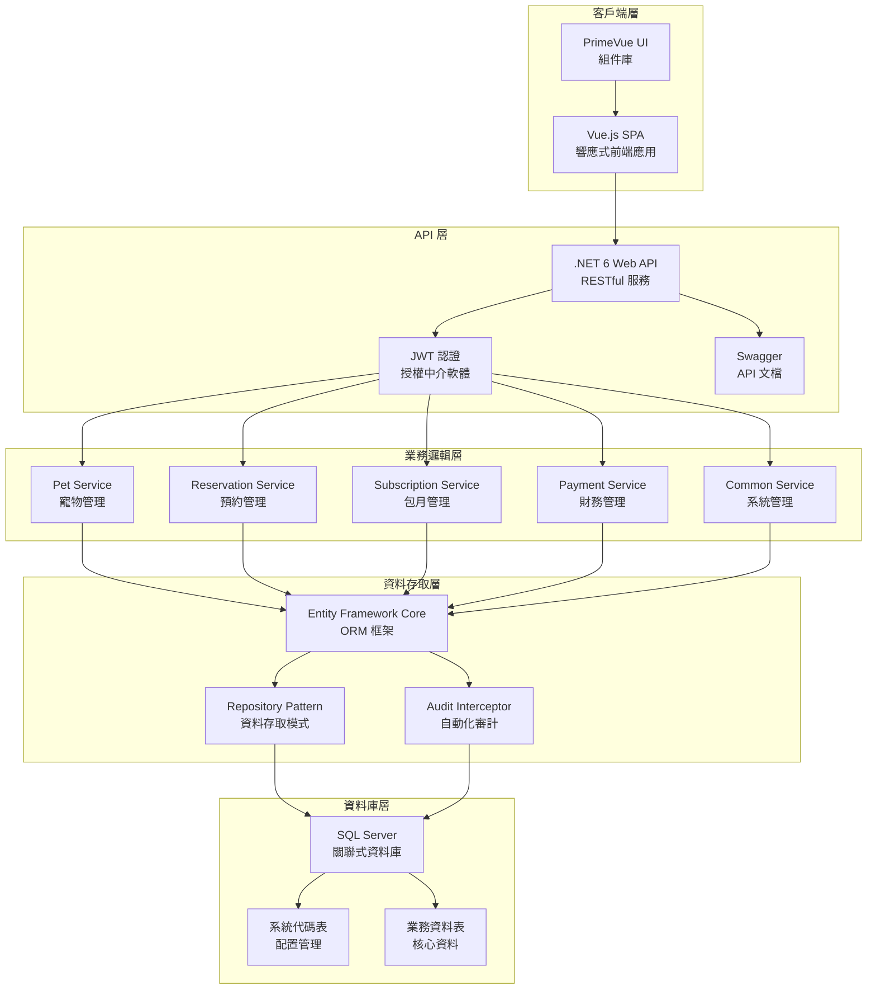
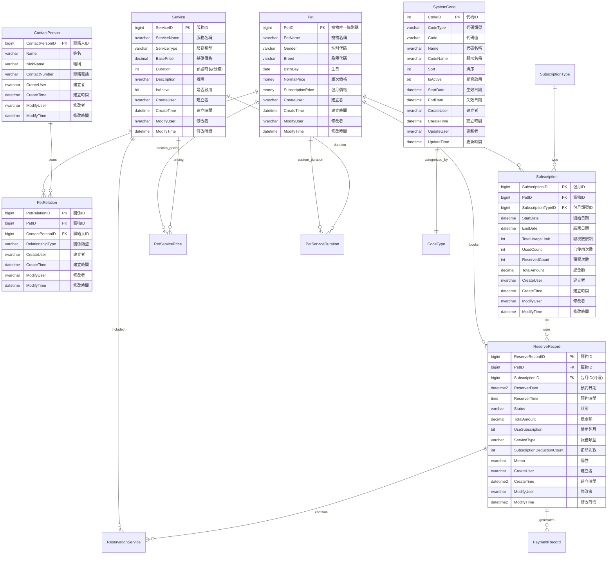

# 🐾 PetSalon - 寵物美容院管理系統

[](https://dotnet.microsoft.com/)
[](https://vuejs.org/)
[](https://www.typescriptlang.org/)
[](https://www.microsoft.com/sql-server)

## 📖 專案概述

PetSalon 是一個現代化的寵物美容院管理系統，採用前後端分離架構，提供完整的業務流程管理解決方案。系統涵蓋寵物資料管理、預約排程、包月服務、財務記錄等核心功能，幫助寵物美容院提升營運效率。

### 🎯 核心特色

- **現代化技術棧**: .NET 6 + Vue 3 + TypeScript + SQL Server
- **響應式設計**: 支援桌面和行動裝置
- **模組化架構**: 易於維護和擴展
- **安全機制**: JWT 認證、權限管理、審計日誌
- **業務智能**: 財務報表、預約統計、客戶分析

## 🏗️ 系統架構

### 整體架構圖



### 技術棧詳細

| 層級 | 技術 | 版本 | 說明 |
|------|------|------|------|
| **前端** | Vue.js | 3.4+ | 漸進式 JavaScript 框架 |
| | TypeScript | 5.4+ | 靜態類型檢查 |
| | PrimeVue | 4.3+ | 企業級 UI 組件庫 |
| | Pinia | 2.2+ | 狀態管理 |
| | Vite | 5.3+ | 建置工具 |
| **後端** | .NET | 6.0 | 跨平台開發框架 |
| | Entity Framework Core | 6.0+ | ORM 框架 |
| | JWT Bearer | - | 認證授權 |
| | Swagger/OpenAPI | - | API 文檔 |
| **資料庫** | SQL Server | 2019+ | 關聯式資料庫 |
| **工具** | Git | - | 版本控制 |
| | Docker | - | 容器化部署 |

## 🗄️ 資料庫設計

### 資料表關聯圖 (ERD)



### 核心業務表說明

| 資料表 | 用途 | 關鍵欄位 |
|--------|------|----------|
| **Pet** | 寵物基本資料 | PetName, Breed, Gender, NormalPrice, SubscriptionPrice |
| **ContactPerson** | 聯絡人資料 | Name, ContactNumber |
| **PetRelation** | 寵物聯絡人關係 | PetID, ContactPersonID, RelationshipType |
| **ReserveRecord** | 預約記錄 | PetID, ReserverDate, Status, UseSubscription |
| **Subscription** | 包月方案 | PetID, StartDate, EndDate, TotalUsageLimit |
| **Service** | 服務項目 | ServiceName, ServiceType, BasePrice, Duration |
| **SystemCode** | 系統代碼 | CodeType, Code, Name (品種、性別、狀態等) |
| **PaymentRecord** | 收支記錄 | Amount, PaymentType, PaymentDate |

## 🚀 功能模組

### 1. 🐕 寵物管理模組
- **寵物檔案管理**: 新增、編輯、刪除寵物資料
- **照片上傳**: 支援 JPG、PNG、GIF 格式
- **客製化定價**: 針對特定寵物設定個別價格
- **品種管理**: 系統代碼維護犬種分類
- **聯絡人綁定**: 建立寵物與飼主關係

**主要功能**:
```
✅ 寵物基本資料 (姓名、品種、性別、生日)
✅ 大頭貼上傳與管理
✅ 單次美容價格設定
✅ 包月優惠價格設定
✅ 聯絡人關係管理 (飼主、家人、照護者)
```

### 2. 👥 聯絡人管理模組
- **聯絡人檔案**: 飼主及相關聯絡人資料維護
- **多重關係**: 支援飼主、家人、朋友、照護者等關係
- **聯絡資訊**: 電話、暱稱等聯絡方式
- **寵物關聯**: 一個聯絡人可管理多隻寵物

**關係類型**:
- 飼主 (OWNER)
- 爸爸 (FATHER)
- 媽媽 (MOTHER)
- 家人 (FAMILY)
- 朋友 (FRIEND)
- 照護者 (CAREGIVER)

### 3. 📅 預約管理模組
- **預約排程**: 日期時間選擇與衝突檢查
- **服務選項**: 美容、洗澡、造型等服務項目
- **包月整合**: 自動檢測可用包月方案
- **狀態追蹤**: 預約流程狀態管理
- **日曆檢視**: 視覺化預約時程表

**預約狀態流程**:
```
待確認 (PENDING) → 已確認 (CONFIRMED) → 進行中 (IN_PROGRESS) → 已完成 (COMPLETED)
                                    ↓
                  已取消 (CANCELLED) / 未出席 (NO_SHOW)
```

**核心功能**:
```
✅ 預約時間管理
✅ 服務項目選擇
✅ 包月方案自動套用
✅ 費用自動計算
✅ 預約狀態追蹤
✅ 日曆檢視介面
```

### 4. 💳 包月服務模組
- **方案管理**: 不同類型包月方案設定
- **使用追蹤**: 剩餘次數與到期日管理
- **自動扣抵**: 預約時自動扣除包月次數
- **期限控制**: 有效期限內使用限制
- **優惠定價**: 包月客戶專屬價格

**包月方案類型**:
- 基礎洗澡 (4次/月)
- 精緻美容 (2次/月)
- VIP 全包 (6次/月)
- 客製化方案

**業務邏輯**:
```
📊 次數管理: 總次數 - 已使用 - 預留 = 可用次數
⏰ 時效性: StartDate ≤ 預約日期 ≤ EndDate
💰 定價: 包月客戶享優惠價格或免費服務
🔄 自動續約: 到期前提醒續約
```

### 5. 💰 財務管理模組
- **收支記錄**: 營收與支出分類管理
- **自動記帳**: 完成預約自動產生收入記錄
- **報表統計**: 月報、年報等財務分析
- **分類管理**: 收入支出項目分類

**收入類型**:
- 美容服務 (GROOMING)
- 零售商品 (RETAIL)
- 包月方案 (SUBSCRIPTION)
- 其他收入 (OTHER)

**支出類型**:
- 水電費 (UTILITIES)
- 電話費 (PHONE)
- 租金 (RENT)
- 用品耗材 (SUPPLIES)
- 設備維護 (EQUIPMENT)
- 行銷費用 (MARKETING)

### 6. ⚙️ 系統管理模組
- **系統代碼**: 品種、性別、狀態等基礎資料維護
- **使用者管理**: 帳號權限與角色設定
- **代碼類型**: 動態新增系統代碼分類
- **審計日誌**: 資料異動追蹤記錄

**系統代碼類型**:
```
🐕 Breed: 犬種分類 (貴賓、黃金獵犬、柴犬...)
⚥ Gender: 性別分類 (公、母)
🏷️ ServiceType: 服務類型 (美容、洗澡、造型...)
📋 ReservationStatus: 預約狀態
👥 Relationship: 關係類型
💸 PaymentType: 付款方式
```

## 📡 API 端點

### 寵物管理 API
```http
GET    /api/pet                    # 取得所有寵物清單
GET    /api/pet/{id}              # 取得特定寵物詳細資料
POST   /api/pet                   # 新增寵物
PUT    /api/pet/{id}              # 更新寵物資料
DELETE /api/pet/{id}              # 刪除寵物
POST   /api/pet/{id}/photo        # 上傳寵物照片
GET    /api/pet/contact/{contactId} # 取得特定聯絡人的寵物清單
```

### 預約管理 API
```http
GET    /api/reservation           # 取得預約清單
GET    /api/reservation/{id}      # 取得預約詳細資料
POST   /api/reservation           # 新增預約
PUT    /api/reservation/{id}      # 更新預約
DELETE /api/reservation/{id}      # 取消預約
POST   /api/reservation/{id}/complete # 完成預約
GET    /api/reservation/calendar  # 取得日曆格式預約資料
POST   /api/reservation/calculate-cost # 計算預約費用
```

### 包月服務 API
```http
GET    /api/subscription          # 取得包月方案清單
GET    /api/subscription/{id}     # 取得包月方案詳細資料
POST   /api/subscription          # 新增包月方案
PUT    /api/subscription/{id}     # 更新包月方案
GET    /api/subscription/pet/{petId} # 取得寵物的包月方案
GET    /api/subscription/types    # 取得包月方案類型
```

### 系統代碼 API
```http
GET    /api/common/systemcodes/{type}     # 取得特定類型系統代碼
GET    /api/common/systemcode-types       # 取得所有代碼類型
POST   /api/common/systemcodes            # 新增系統代碼
PUT    /api/common/systemcodes/{id}       # 更新系統代碼
DELETE /api/common/systemcodes/{id}       # 刪除系統代碼
```

## 🔐 認證與授權

### JWT 認證機制
- **Token 有效期**: 預設 30 分鐘
- **刷新機制**: 支援 Token 刷新
- **角色權限**: Admin、User 角色分級
- **跨域支援**: CORS 設定允許前端存取

### 權限控制
```csharp
[Authorize] // 需要登入
[Authorize(Roles = "Admin")] // 需要管理員權限
```

## 🚀 快速開始

### 環境需求
- **.NET SDK**: 6.0 或更新版本
- **Node.js**: 18.0 或更新版本  
- **SQL Server**: 2019 或更新版本
- **Git**: 版本控制工具

### 1. 複製專案
```bash
git clone <repository-url>
cd PetSalon
```

### 2. 資料庫設定
```bash
# 1. 建立資料庫
# 在 SQL Server 中建立名為 'PetSalon' 的資料庫

# 2. 執行資料表建立腳本
# 依序執行 SQL/10-Table/ 中的所有 .sql 檔案

# 3. 初始化系統代碼
# 執行 SQL/70-InintialData/ 中的初始化資料腳本
```

### 3. 後端設定與啟動
```bash
# 進入後端專案目錄
cd PetSalon.Backend/PetSalon.Web

# 設定資料庫連線字串 (編輯 appsettings.json)
# "DefaultConnection": "Server=your_server;Database=PetSalon;Trusted_Connection=true;"

# 還原 NuGet 套件
dotnet restore

# 建置專案
dotnet build

# 啟動 API 服務
dotnet run
```

後端服務將在 `http://localhost:5150` 啟動，Swagger 文檔位於 `http://localhost:5150/swagger`

### 4. 前端設定與啟動
```bash
# 進入前端專案目錄
cd PetSalon.Frontend

# 安裝相依套件
npm install

# 啟動開發伺服器
npm run dev
```

前端應用將在 `http://localhost:3000` 啟動

### 5. 驗證安裝
1. 開啟瀏覽器造訪 `http://localhost:3000`
2. 檢查 API 端點: `http://localhost:5150/swagger`
3. 測試系統代碼 API: `http://localhost:5150/api/common/systemcode-types`

## 📦 專案結構

```
PetSalon/
├── 📁 PetSalon.Backend/         # 後端 .NET 專案
│   ├── 📁 PetSalon.Web/         # Web API 層
│   │   ├── 📁 Controllers/      # API 控制器
│   │   ├── 📁 Models/           # 請求/回應模型
│   │   └── 📄 Program.cs        # 應用程式進入點
│   ├── 📁 PetSalon.Services/    # 業務邏輯層
│   │   ├── 📁 PetService/       # 寵物相關服務
│   │   ├── 📁 ReservationService/ # 預約相關服務
│   │   └── 📁 SubscriptionService/ # 包月相關服務
│   ├── 📁 PetSalon.Models/      # 資料模型層
│   │   ├── 📁 EntityModels/     # EF 實體模型
│   │   └── 📁 DTOs/            # 資料傳輸物件
│   └── 📁 PetSalon.Tools/       # 工具類別
├── 📁 PetSalon.Frontend/        # 前端 Vue.js 專案
│   ├── 📁 src/
│   │   ├── 📁 views/           # 頁面元件
│   │   ├── 📁 components/      # 可重用元件
│   │   ├── 📁 api/            # API 服務層
│   │   ├── 📁 types/          # TypeScript 型別定義
│   │   ├── 📁 stores/         # Pinia 狀態管理
│   │   └── 📁 utils/          # 工具函式
│   ├── 📄 package.json        # NPM 相依性設定
│   └── 📄 vite.config.ts      # Vite 建置設定
├── 📁 SQL/                     # 資料庫腳本
│   ├── 📁 10-Table/           # 資料表建立腳本
│   ├── 📁 70-InintialData/    # 初始資料腳本
│   └── 📁 80-Migration/       # 資料庫遷移腳本
├── 📄 README.md               # 專案說明文件
└── 📄 CLAUDE.md               # 開發指引文件
```

## 🛠️ 開發指南

### 後端開發規範

#### 控制器設計
```csharp
[ApiController]
[Route("api/[controller]")]
[Authorize] // JWT 認證
public class PetController : BaseController
{
    [HttpGet]
    public async Task<ActionResult<IList<PetDto>>> GetPets()
    {
        // 實作邏輯
    }
}
```

#### 服務層設計
```csharp
public interface IPetService
{
    Task<IList<Pet>> GetPetList();
    Task<Pet?> GetPet(long petId);
    Task<long> CreatePet(Pet pet);
    Task UpdatePet(Pet pet);
    Task DeletePet(long petId);
}
```

#### 審計欄位
所有實體皆包含自動化審計欄位:
- `CreateUser`: 建立者
- `CreateTime`: 建立時間  
- `ModifyUser`: 修改者
- `ModifyTime`: 修改時間

### 前端開發規範

#### Vue 3 Composition API
```vue
<script setup lang="ts">
import { ref, onMounted } from 'vue'
import type { Pet } from '@/types/pet'

const pets = ref<Pet[]>([])

const loadPets = async () => {
  const response = await petApi.getPets()
  pets.value = response.data
}

onMounted(() => {
  loadPets()
})
</script>
```

#### TypeScript 型別定義
```typescript
export interface Pet {
  petId: number
  petName: string
  breed: string
  gender: string
  birthDay?: string
  normalPrice?: number
  subscriptionPrice?: number
}
```

#### API 服務層
```typescript
export const petApi = {
  async getPets(): Promise<Pet[]> {
    const response = await axios.get('/api/pet')
    return response.data
  },
  
  async createPet(pet: Omit<Pet, 'petId'>): Promise<Pet> {
    const response = await axios.post('/api/pet', pet)
    return response.data
  }
}
```

## 🚢 部署指南

### 生產環境部署

#### 1. 後端部署
```bash
# 建置發布版本
dotnet publish -c Release -o ./publish

# 部署到 IIS 或其他 Web 伺服器
```

#### 2. 前端部署
```bash
# 建置生產版本
npm run build

# 部署 dist 資料夾到靜態檔案伺服器
```

#### 3. 資料庫部署
```sql
-- 1. 建立生產資料庫
-- 2. 執行建表腳本
-- 3. 匯入初始資料
-- 4. 設定備份策略
```

### Docker 部署
```dockerfile
# Dockerfile 範例 (後端)
FROM mcr.microsoft.com/dotnet/aspnet:6.0 AS base
WORKDIR /app
EXPOSE 80

FROM mcr.microsoft.com/dotnet/sdk:6.0 AS build
WORKDIR /src
COPY ["PetSalon.Web/PetSalon.Web.csproj", "PetSalon.Web/"]
RUN dotnet restore "PetSalon.Web/PetSalon.Web.csproj"

COPY . .
WORKDIR "/src/PetSalon.Web"
RUN dotnet build "PetSalon.Web.csproj" -c Release -o /app/build

FROM build AS publish
RUN dotnet publish "PetSalon.Web.csproj" -c Release -o /app/publish

FROM base AS final
WORKDIR /app
COPY --from=publish /app/publish .
ENTRYPOINT ["dotnet", "PetSalon.Web.dll"]
```

## 🧪 測試

### 單元測試
```bash
# 執行後端測試
dotnet test PetSalon.Backend/PetSalon.sln

# 執行前端測試
cd PetSalon.Frontend
npm run test:unit
```

### API 測試
- **Swagger UI**: `http://localhost:5150/swagger`
- **Postman Collection**: 匯入 API 測試集合

## 📚 相關文件

- [開發指引](./CLAUDE.md) - 詳細的開發規範和最佳實踐
- [API 文檔](http://localhost:5150/swagger) - 完整的 API 端點文檔
- [資料庫文檔](./SQL/README.md) - 資料庫結構和腳本說明

## 🤝 貢獻指南

1. Fork 此專案
2. 建立功能分支 (`git checkout -b feature/AmazingFeature`)
3. 提交變更 (`git commit -m 'Add some AmazingFeature'`)
4. 推送到分支 (`git push origin feature/AmazingFeature`)
5. 開啟 Pull Request

### 開發規範
- 遵循既有的程式碼風格
- 撰寫清晰的提交訊息
- 新增功能需包含測試
- 更新相關文檔

## 📄 授權條款

此專案採用 MIT 授權條款 - 詳見 [LICENSE](LICENSE) 檔案

## 📞 聯絡方式

- **專案負責人**: [Your Name]
- **Email**: [your.email@example.com]
- **專案網址**: [project-url]

---

**建置時間**: $(date)  
**版本**: 1.0.0  
**狀態**: 🚀 生產就緒